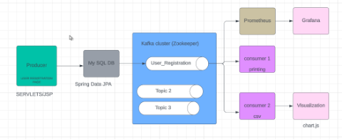

# SportsEvent_regisration
INTRODUCTION

In today's digital era, sports event management has evolved beyond simple registration and ticketing to include complex data analytics that enhance participant engagement and optimize event operations. Real-time data analysis has become crucial for understanding participant dynamics and improving the overall event experience. This project aims to develop a high-performance data pipeline using **Apache Kafka**, **Java Servlets**, **JSP**, and **MySQL** to manage and analyze real-time data generated from sports event registrations.

The system is designed to handle high volumes of data efficiently, ensuring that insights derived from data analytics are timely and actionable.

### Key Technologies Used:
- **Apache Kafka**: Serves as the backbone of this project, enabling real-time data streaming with high throughput, fault tolerance, and scalability. It allows the handling of real-time data streams, which is essential for applications requiring quick data processing and analytics.
  
- **Spring Boot**: The backend framework used to power the application. It facilitates easy configuration and rapid development of production-grade applications.
  
- **Spring Data JPA**: Integrated for seamless database interactions, allowing efficient data storage and retrieval.
  
- **MySQL**: The relational database management system used to store the data.

- **Prometheus**: Used for collecting and storing system metrics, providing insight into the application's health and performance.

- **Grafana**: Provides visualization for Prometheus data, helping monitor real-time metrics in an easy-to-read format.

### Apache Kafka Ecosystem:
At the heart of Kafka's ecosystem are several key components:
- **Producers**: Applications that send records to Kafka topics.
- **Consumers**: Applications that subscribe to Kafka topics and process the incoming data.
- **Kafka Brokers**: Servers that form the Kafka cluster and store the actual data in partitions across multiple brokers, ensuring parallel processing and high scalability.

### Project Architecture:
The system uses a layered architecture that ensures the separation of concerns, making it easier to maintain and scale. The architecture also supports efficient data handling and provides real-time monitoring capabilities, crucial for handling peak loads during event registrations.



# Project Setup and Execution Guide

This document outlines the steps required to set up and run the project, which integrates Apache Kafka, Prometheus, and Grafana with a MySQL database and a Spring Boot application.

## Prerequisites

Ensure you have the following software installed:
- **Spring Tool Suite (STS)**: For managing the Spring Boot project.
- **MySQL**: To manage the database.
- **Kafka**: For event streaming.
- **Prometheus**: For metrics collection.
- **Grafana**: For data visualization.

## Project Setup

### 1. Set Up Spring Boot Project

- Launch **STS** (Spring Tool Suite).
- Import the project from the provided zip file.
- Add **Apache Tomcat** server:
  - Go to `Window -> Show View -> Servers -> New`.
  
### 2. Configure MySQL Data Source

- Open the `application.properties` file.
- Configure your MySQL credentials:
  - Set the `dataSource`, `root`, `password`, and `database` as per your MySQL setup.

### 3. Set Up Kafka, Prometheus, and Grafana

- **Kafka**: Download from [Kafka Downloads](https://kafka.apache.org/downloads).
- **Prometheus**: Download from [Prometheus Downloads](https://prometheus.io/download/).
- **Grafana**: Download from [Grafana Downloads](https://grafana.com/grafana/download/).

### 4. Set Up Kafka

- Navigate to the Kafka download directory and go to the `bin` folder.
- Open 3 separate **Command Prompt** windows (as Administrator) and run the following commands:

  1. Start Zookeeper:
     ```bash
      bin/zookeeper-server-start.sh config/zookeeper.properties
     ```

  2. Start Kafka Cluster:
     ```bash
     bin/kafka-server-start.sh config/server.properties
     ```

  3. Create a topic named `user-registrations`:
     ```bash
      bin/kafka-topics.sh --create --topic user-registrations --bootstrap-server localhost:9092 --replication-factor 1 --partitions 1
     ```

### 5: Useful commands


4. **Delete a topic**
   ```bash
    bin/kafka-topics.sh --zookeeper localhost:9092 --delete –topic  user-registrations
   ```

6. **List Existing Topics:**
   To see a list of all topics available in your Kafka cluster, you can use the following command:
   ```
   bin/kafka-topics.sh --list --bootstrap-server localhost:9092
   ```

7. **Describe a Topic:**
   To see details about a specific topic, such as its configuration and partitions, you can use the following command:
   ```
   bin/kafka-topics.sh --describe --topic user-registrations --bootstrap-server localhost:9092
   ```

8. **View Messages in a Topic:**
   To view the messages in a topic, Kafka provides a console consumer. You can consume messages from the topic using the following command:
   ```
   bin/kafka-console-consumer.sh --topic user-registrations --bootstrap-server localhost:9092 --from-beginning
   ```


### 5. Set Up MySQL

- Create a database in MySQL as per the settings in `application.properties`.
- Populate the data for the tables once the project is running in STS.

### 6. Run the Spring Boot Project

- In **STS**, right-click on the project.
- Select `Run As -> Spring Boot App`.
- Once the project starts, open your browser and go to `http://localhost:8080/`.
  
The application frontend page will load, and as users register for events, the data will be updated in the database, Kafka topic, and CSV files. The CSV data will be displayed in visualizations on the dashboard page.

### 7. Access Metrics

- To view metrics, navigate to: `http://localhost:8080/actuator/metrics`.

### 8. Set Up Prometheus

- Modify the `prometheus.yml` configuration file to include:
  ```yaml
  metrics_path: '/actuator/prometheus'
  static_configs:
    - targets: ["localhost:8080"]
